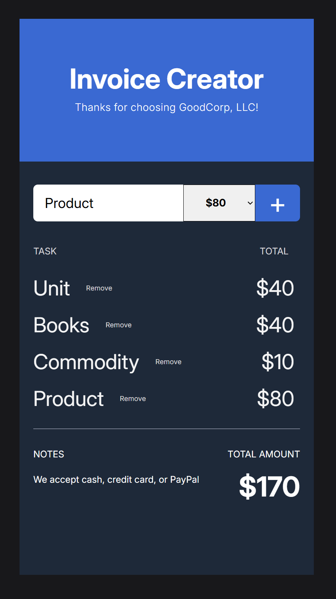

# Project Overview

This project is part of a larger collection of React + TypeScript productivity applications. Built with modern frontend technologies, it aims to provide a clean, intuitive interface for everyday tasks.

## Quick Start

```bash
# Install dependencies
npm install

# Start development server
npm run dev

# Build for production
npm run build

# Preview production build
npm run preview
```

## Tech Stack

- React 19
- TypeScript
- Tailwind CSS
- Vite

## Features

- Responsive design that works on mobile and desktop
- Clean, minimalist UI focused on functionality
- State management using React hooks
- Type-safe implementation with TypeScript

## Project Structure

```
src/
├── components/    # Reusable UI components
├── App.tsx        # Main application component
├── main.tsx       # Entry point
└── index.css      # Global styles and Tailwind imports
```

For more information about all projects in this collection, please see the repository's main README.